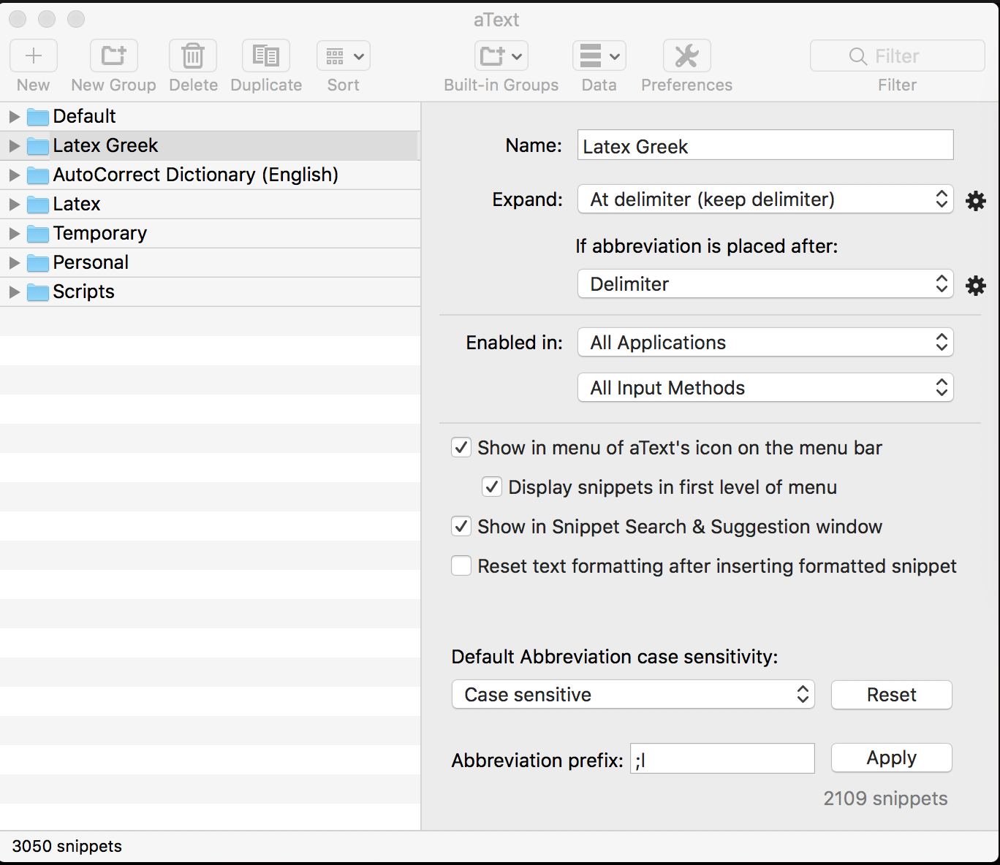
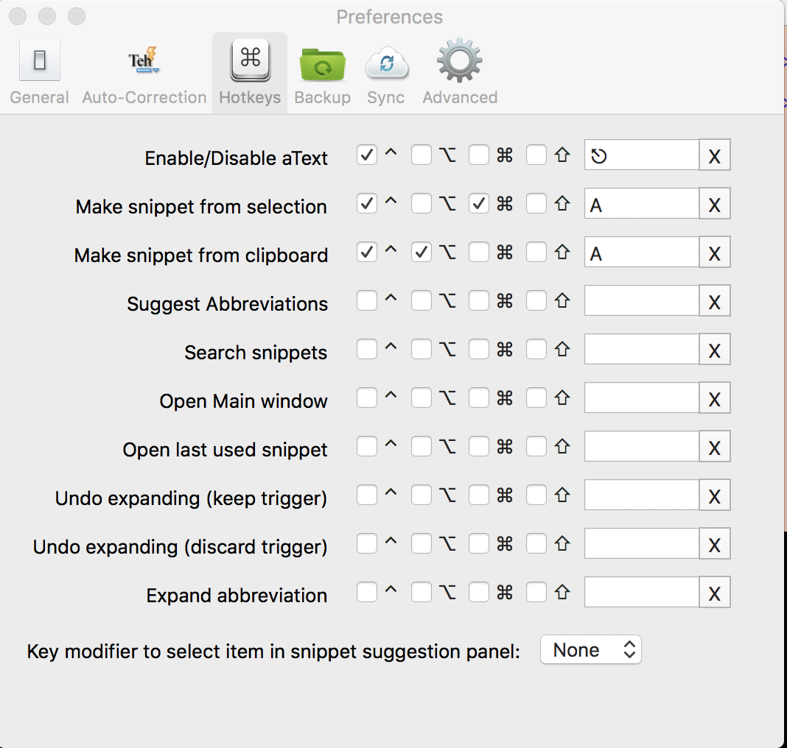

Importing snippets in aText
==============================
```
Open aText
Data > Import data > load_the_given_Latex.csv
  
Caveats:
============
  - Do dot use tab completion, original tab will be disabled, instead use "expand at delimiter". 
  - Do not use built-in dictionary wildy, it may bite you, eg. whic exapands to which, you can never type 'whichever'.
```  
    
## Usage
```bash
Usage:
tba = \boldsymbol{a}
bay = \boldsymbol{\alpha}
xxa = $a$
And so on.
```

**English Alphabet:**
```bash
Text            A               Bold            Dollar
-----------------------------------------------------------
Bold            tba             tba             tbax
Dollar          xxa             xxba            xxa
Script          say             say             sayx


tba = \boldsymbol{a}
tbax = $\boldsymbol{a}$
xxa = $a$
xxba = $\boldsymbol{a}$ 
say = \mathscr{A}
sayx = $\mathscr{A}$

NOTE: tsb = tau script bold
```

**Greek Alphabet:**

```bash

Prefix with y: PAB  (Partial, Angle, Bold)
All Suffixes : BP HST MD 0123

Suffix  : Bar, Prime (BP)
Suffix  : Hat, Star, Tilde (HST MD 0123)
Suffix  : Modulus, Dot, 0, 1, 2, 3 (MD 0123)


Prefix/Suffix   A               Bold            Dollar         Bold Dollar
---------------------------------------------------------------------------
Partial         pay             paby            payx           pabyx
Angle           aay             aaby            aayx           aabyx
Bold            bay             bay             bayx           bayx    
----------------------------------------------------------------------------
Bar             ab              abb             abx            abbx
Prime           ap              apb             apx            apbx
Hat             ah              ahb             ahx            ahbx
Star            as              asb             asx            asbx
Tilde           at              atb             atx            atbx
Modulus         am              amb             amx            ambx
Dot             ad              adb             adx            adbx
Zero            a0              a0b             a0x            a0bx
One             a1              a1b             a1x            a1bx
Two             a2              a2b             a2x            a2bx
Three           a3              a3b             a3x            a3bx


 
ab = \bar{\alpha}       Bar
ap = \alpha\prime       Prime

ah = \hat{\alpha}       Hat
as = \alpha^*           Star
at = \tilde{\alpha}     Tilde

am = \lvert\alpha\rvert Modulus
ad = \dot{\alpha}       Dot

a0 = \alpha_0
```
    
 ## My configurations
 
 

